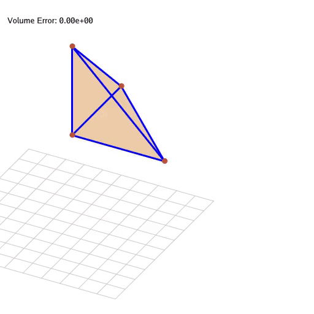

The tutorial code to implement explicit & implicit FEM simulation using Taichi.

For a didactic purpose, the code is written in a simple way with **only one tetrahedron** element.

Reference: 
[Sifakis, SIGGRAPH 2012 Course FEM Simulation of 3D Deformable Solids Part One Chapter 4]( https://viterbi-web.usc.edu/~jbarbic/femdefo/sifakis-courseNotes-TheoryAndDiscretization.pdf)
(Especially the Algorithm 1 in Chapter 4)

usage: 
```
    python tiFEM.py 
```

Demo:



## Unimportant notes about the code

You don't need to read this part to understand the main idea of the code. Just some additional notes if you are interested.

### Explicit / Implicit integration
Uncomment the implicit substep function to see the implicit integration.

```
#implicit substep
# def substep():
#     cg()
#     floor_bound()

# uncomment to see the explicit substep
def substep():
    for i in range(10):
        get_force()
        advect()
    floor_bound()
```


### Different constuitive law
Use comment/uncomment to switch between different constitutive laws in the `get_force_func` function.

```
def get_force_func(c, verts):
    F = Ds(verts) @ rest_matrix[c]
    U, sig, V = ssvd(F)
    R = U @ V.transpose()
    I = ti.Matrix.identity(ti.f32, 3)

    # Linear Elasticity
    # P = mu * (F+F.transpose()-2*I) + la * (F-I).trace()*I

    # StVK
    # E = 0.5 * (F.transpose() @ F - I)
    # P = F @ (2*mu*E+la*E.trace()*I)

    # CR(Corotational Linear)
    # P = 2 * mu * (F - R) + la * (R.transpose()@F - I).trace()*R

    # As-Rigid-As-Possible (same with CR when la=0)
    P = 2 * mu * (F - R)

    # Neo-Hookean
    # FT_inv = F.inverse().transpose()
    # J = F.determinant()
    # P = mu * (F - FT_inv) + la * ti.log(J) * FT_inv
    ...
```


### implicit_fem.py
The code is based on the taichi example implicit_fem, where you can download the original source code by typing `ti example -s implicit_fem`. My version of implicit_fem.py is minorly modified from the original one to fix the rendering bug on MacOS and add pause functionality.

What it looks like:
